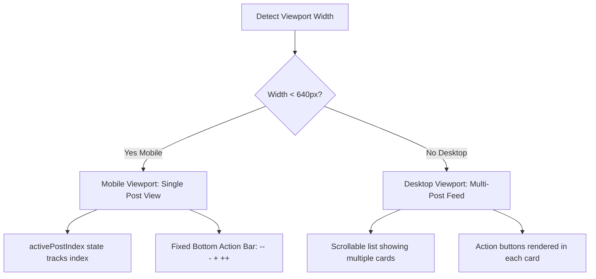

# Dashboard UI & Layout Specification

This document details the page layout, PWA specifications, component definitions, queries, media rendering, and stable viewport interactions for the Firebase-hosted Web Dashboard.

---

## 1. Application Routing & Views

The dashboard is structured as a single-page application (SPA) containing three primary routes.

```text
/
├── /login            # Unauthenticated landing page (Google OAuth button)
├── /feed             # Default view (unrated custom feed, stable reading order)
└── /archive          # Review view (history of rated posts, search/reset options)
```

---

## 2. Authentication & Access Control

### 2.1 Firebase Auth Client Flow (Dashboard Access)
- Upon opening the app, check `firebase.auth().onAuthStateChanged()`.
- If the user is unauthenticated, redirect to `/login`.
- If the user is authenticated, check their Google email address against the whitelisted address configured during build time:
  - If it matches: redirect to `/feed`.
  - If it does not match: sign the user out immediately and display a clean "Access Denied" message.

### 2.2 ATProto OAuth Session (Bluesky Access)
To interact with the Bluesky API for Liking and Following, the app maintains a client-side OAuth session.
- **Connect Trigger:** A "Connect Bluesky Account" button is rendered in the dashboard header if no active ATProto session token exists in LocalStorage.
- **Metadata Configuration:** The dashboard must serve a valid OAuth client metadata document at `https://social.rochebit.net/client-metadata.json` matching:
  ```json
  {
    "client_id": "https://social.rochebit.net/client-metadata.json",
    "client_name": "ATProto Dev Feed Monitor",
    "client_uri": "https://social.rochebit.net",
    "redirect_uris": ["https://social.rochebit.net/feed"],
    "scope": "atproto",
    "grant_types": ["authorization_code", "refresh_token"],
    "response_types": ["code"],
    "token_endpoint_auth_method": "none",
    "application_type": "web",
    "dpop_bound_access_tokens": true
  }
  ```

---

## 3. Stable Viewport Feed Query Logic

To prevent posts from shifting or moving while reading, the feed does **not** bind a real-time listener directly to the view. Instead, it uses a manual-refresh pagination model.

### 3.1 Page Load Query (Stale Read Window)
1. **Initialize State:** When `/feed` mounts, record `pageLoadTime = new Date().toISOString()`.
2. **Execute Static Fetch:** Query Firestore once (`.get()`):
   - **Collection:** `posts`
   - **Filters:**
     - `isDeleted == false`
     - `feedback == null`
     - `matchedAt <= pageLoadTime`
   - **Sorting:** `matchedAt` (Descending)
   - **Limit:** 50 documents.
3. Render this static array. The items remain completely stationary.

### 3.2 Dynamic Backlog Tracking (Floating Refresh Banner)
1. Simultaneously, query only the **count** of newer posts: `isDeleted == false`, `feedback == null`, `matchedAt > pageLoadTime`.
2. If the snapshot returns a count `N > 0`, display a floating, sticky banner at the top center of the viewport: `[ 🗘 Load {N} new posts ]`.
3. **Click Action:** Update `pageLoadTime`, re-run static query, replace feed state, and scroll back to top.

---

## 4. Layout & Viewport Variations (Mobile vs. Desktop)

The dashboard presents different layouts depending on the user's screen width.



### 4.1 Mobile Single-Post View (`@media (max-width: 639px)`)
To optimize parsing speed on a phone, the mobile UI presents posts one-at-a-time in full screen.
- **Fullscreen Container:** The main viewport is locked to `width: 100vw` and height `100dvh` (dynamic viewport height to adjust for mobile browser bars). Scrolling on the main body is disabled (`overflow: hidden`).
- **Active Post State:** The React/SPA client maintains an integer state `activePostIndex = 0`.
- **Card Rendering:** The UI renders **only** the single post card matching `posts[activePostIndex]`. This card is centered on screen, takes up 100% of available height (with internal scrolling enabled for very long posts), and has a bottom padding of `80px` to clear the action bar.
- **Fixed Bottom Action Bar:** A sticky container anchored at the bottom of the screen:
  - **CSS:** `position: fixed; bottom: 0; left: 0; right: 0; height: 72px; z-index: 1000; background-color: #1e293b; border-top: 1px solid #334155; display: flex; justify-content: space-around; align-items: center;`
  - **Button Stability:** The buttons remain in the exact same location on the screen at all times, regardless of post length or scrolling.
- **Transition Action:** When a feedback button is clicked:
  - Trigger Firestore document update.
  - Increment `activePostIndex = activePostIndex + 1`.
  - Trigger a CSS card-swipe slide transition.

### 4.2 Desktop Multi-Post View (`@media (min-width: 640px)`)
- Renders as a standard vertical timeline feed showing multiple posts in a single page view.
- Max-width of the feed container is `640px` centered on screen.
- Each post card embeds its own individual action bar.

---

## 5. Extended Feedback Action Buttons

Instead of a simple binary rating, the UI displays four small, iconized/symbolic feedback buttons.

```text
+---------------------------------------------+
|  [ -- ]     [ - ]     [ + ]     [ ++ ]      |
|  Negative  Neutral  Positive  Extra Pos.    |
+---------------------------------------------+
```

### 5.1 Button Mappings & Firestore Values
Clicking a button sets the corresponding string in the post's `feedback` field in Firestore:

1. **`--` / Double Minus Icon (Negative):**
   - Saves `feedback = "negative"`.
   - Represents off-topic, spam, or noise.
2. **`-` / Single Minus Icon (Neutral):**
   - Saves `feedback = "neutral"`.
   - Represents dev-related posts that you have no personal interest in.
3. **`+` / Single Plus Icon (Positive):**
   - Saves `feedback = "positive"`.
   - Represents relevant, high-signal developer topics.
4. **`++` / Double Plus Icon (Extra Positive):**
   - Saves `feedback = "extra_positive"`.
   - Represents highly important or actionable community updates, library launches, or self-hosted announcements.

---

## 6. UI Component Specifications (Post Card)

Every post card renders:
1. **Header:** Author handle and relevance score badge.
2. **Parent Context Preview:** Small nested card showing parent post text.
3. **Post Body (Rich Text):** Parses byte offsets using `facets` to construct clickable HTML links.
4. **Media Embed Box:**
   - **Images:** inline hotlinked thumbnail grid.
   - **External Link Card:** clickable banner.
   - **Video:** HTML5 `<video>` using native HLS (Safari) or `hls.js` script binding (Chrome/Android).
5. **Quoted Context Preview:** Small nested card showing quote post text.
6. **Metadata Footer:** Relative timestamp and Gemini explanation.
7. **Engagement Buttons:** Like button (calls PDS `app.bsky.feed.like`), Follow button (calls PDS `app.bsky.graph.follow`), and Open button (opens `bsky.app`).
8. **Feedback Buttons:**
   - On Desktop: Rendered at the bottom of each card.
   - On Mobile: Handled via the fixed bottom action bar.

---

## 7. Progressive Web App (PWA) Specifications
- Includes `manifest.json` and service worker `sw.js` for standalone app installation.

---

## 8. Design Tokens & Theme Guidelines

| Token Category | Value | Application |
|---|---|---|
| **Typography** | Font Family: `Inter, sans-serif` | Applied globally to all text. |
| **Theme Mode** | Dark Mode Only | Global background: `#0f172a` (Slate 900) / Text color: `#f8fafc` (Slate 50). |
| **Card Styling** | Background: `#1e293b` (Slate 800) | Rounded corners: `8px`. Border: `1px solid #334155`. |
| **Feed Layout** | Max-Width: `640px` (Centered) | Renders as a single-column container with `16px` gaps. |
| **Active States** | Like: `#ef4444` (Red 500) | Filled heart icon when liked. |
| **Active States** | Follow: `#38bdf8` (Sky 400) | Button text changes to "Following". |

---

## 9. Assumptions Log

| ID | Description | Status | Resolution / Date |
|---|---|---|---|
| A008 | Client-side search and filtering in the UI is not required for version 1. | `[CONFIRMED]` | Confirmed by User on 2026-07-01. |
