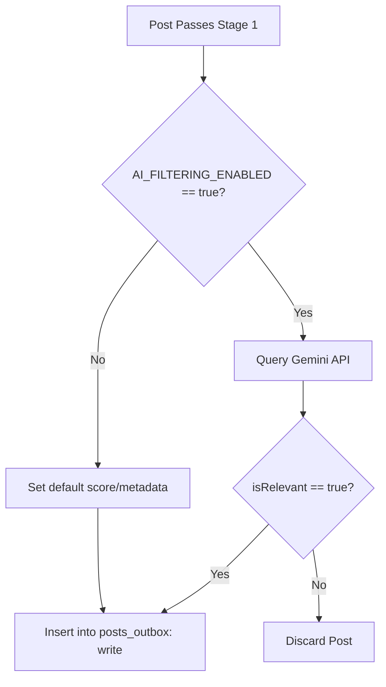

# Ingestion & Filtering Pipeline Specification

This document details the step-by-step logic for the real-time Jetstream consumer, the dynamic network graph sync, the local SQLite outbox queue, the fast rule-based pre-filter, the parent/quote context crawler, the liked/reposted content resolver, the Gemini LLM relevance evaluation workflow, error handling for processing failures, and the simple feedback archive mechanism.

---

## 1. Configuration Settings

The Home Server daemon loads configuration parameters from a local environment file (`.env`).

| ID | Configuration Key | Data Type | Default Value | Description |
|---|---|---|---|---|
| 1.1 | **`AI_FILTERING_ENABLED`** | boolean | `true` | When `false`, posts that match the pre-filter bypass Gemini evaluation and are written to the outbox immediately. |
| 1.2 | **`GEMINI_API_KEY`** | string | `""` | API key used for the Gemini relevance evaluation. Required if `AI_FILTERING_ENABLED` is `true`. |
| 1.3 | **`DATETIME_FORMAT`** | string | `"ISO-8601"` | Standard format for all database timestamps (UTC string, e.g., `YYYY-MM-DDTHH:mm:ss.sssZ`). |
| 1.4 | **`USER_DID`** | string | `""` | The ATProto Decentralized Identifier (DID) of the owner (used to monitor follow/like/repost events from the firehose). |

---

## 2. Ingestion Flow (Jetstream Consumer)

The Home Server daemon maintains a persistent WebSocket connection to subscribe to posts, follows, reposts, and likes.

### 2.1 Connection & Handshake
* 2.1.1. **Target URL:** Connect to the Jetstream endpoint: `wss://jetstream2.us-east.bsky.network/subscribe`
* 2.1.2. **Query Parameters:** Filter firehose updates using the following parameters:
  - 2.1.2.1. `wantedCollections=app.bsky.feed.post`
  - 2.1.2.2. `wantedCollections=app.bsky.graph.follow`
  - 2.1.2.3. `wantedCollections=app.bsky.feed.repost`
  - 2.1.2.4. `wantedCollections=app.bsky.feed.like`
* 2.1.3. **Reconnection & Cursor Management:**
  - 2.1.3.1. Track the `seq` integer field from incoming messages.
  - 2.1.3.2. Persist the latest sequence number locally to a state file (`cursor.json`) every 5 seconds.
  - 2.1.3.3. Implement exponential backoff reconnection on disconnection: start at 1s, double up to a maximum of 60s, with a random jitter of ±100ms.
  - 2.1.3.4. When reconnecting, append the `cursor` query parameter with the last saved `seq` value:
    `wss://jetstream2.us-east.bsky.network/subscribe?wantedCollections=app.bsky.feed.post&wantedCollections=app.bsky.graph.follow&wantedCollections=app.bsky.feed.repost&wantedCollections=app.bsky.feed.like&cursor={seq}`

### 2.2 Firestore Document ID Generation Rule
* 2.2.1. **Hashing Scheme:** Generate a predictable, unique document ID (`postId`) from the ATProto URI.
* 2.2.2. **Implementation:** Apply the `SHA-256` hashing algorithm to the post URI string (e.g., `at://did:plc:123/app.bsky.feed.post/456`), and use the resulting 64-character hex string as the Firestore Document ID.

### 2.3 Event Parsing & Operation Routing
For every message received, the daemon checks the collection type and routes the payload:
* 2.3.1. **`app.bsky.feed.post` Collections:**
  - 2.3.1.1. **Create Operations (`commit.operation == "create"`):** Route to **Section 3: Stage 1: Rule-Based & Network Pre-Filtering**.
  - 2.3.1.2. **Delete Operations (`commit.operation == "delete"`):** Construct the post URI (`at://{did}/{collection}/{rkey}`), calculate the Firestore document ID using the rule in section 2.2.2, and write a delete action to the local outbox.
* 2.3.2. **`app.bsky.graph.follow` Collections:**
  - 2.3.2.1. Route to **Section 4.3: Real-Time Firehose Syncing (Jetstream events)**.
* 2.3.3. **`app.bsky.feed.repost` & `app.bsky.feed.like` Collections:**
  - 2.3.3.1. **Create Operations (`commit.operation == "create"`):** If the actor `did` matches the user's DID (`USER_DID`) or matches an entry in `first_degree_follows`, route to **Section 6: Liked & Reposted Content Resolver**.
  - 2.3.3.2. **Delete Operations:** Ignore.
* 2.3.4. **Other Operations:** Discard immediately.

---

## 3. Stage 1: Rule-Based & Network Pre-Filtering

To minimize LLM token usage and latency, posts must pass a rule-based pre-filter. A post proceeds to evaluation if it satisfies **any** of the following conditions:

### 3.1 Network Graph Match (Bypass Keywords)
* 3.1.1. **Rule:** Check if the post `authorDid` matches an entry in your local SQLite table `first_degree_follows`.
* 3.1.2. **Outcome:** Posts matching this condition bypass keyword checks completely and proceed directly to **Section 8: Stage 2: Relevance Evaluation Flow**.

### 3.2 Keyword & Regex Matching (For General Network Posts)
If the author is not in your network graph, the post text must match any of the following case-insensitive regex patterns:
* 3.2.1. `\batproto\b` (AT Protocol)
* 3.2.2. `\bbluesky\s+dev\b` (Bluesky Dev)
* 3.2.3. `\blexicon\b` (ATProto Lexicon definitions)
* 3.2.4. `\bpds\b` (Personal Data Server)
* 3.2.5. `\bxrpc\b` (ATProto RPC protocol)
* 3.2.6. `\bappview\b` (AppView indexing)
* 3.2.7. `\bdid:plc:\w+\b` (DIDs)
* 3.2.8. `\bat://\w+\b` (AT URI scheme)
* 3.2.9. `\bfederat(e|ion)\b` (Federation context)
* 3.2.10. `\bself-host(ing|ed)?\b` (Self-hosting)

### 3.3 Curated Whitelist Matching
* 3.3.1. **Rule:** Check if the post `authorDid` matches an entry in the locally stored whitelist file (`curated_devs.json`), or is a reply to/repost of someone on that list.

---

## 4. SQLite Database Specifications (`network_graph.db`)

The daemon manages local state using a single-file SQLite database.

### 4.1 Schema
The SQLite database must contain the following tables:

* 4.1.1. **`first_degree_follows` Table:**
```sql
CREATE TABLE first_degree_follows (
    rkey TEXT PRIMARY KEY,
    followed_did TEXT UNIQUE
);
```
* 4.1.2. **`posts_outbox` Table:**
```sql
CREATE TABLE posts_outbox (
    post_id TEXT PRIMARY KEY,       -- SHA-256 hash of post URI
    uri TEXT NOT NULL,
    action TEXT NOT NULL,          -- 'write' or 'delete'
    payload TEXT,                  -- JSON string of document fields (NULL for 'delete')
    status TEXT DEFAULT 'pending', -- 'pending', 'failed'
    retry_count INTEGER DEFAULT 0,
    created_at TEXT NOT NULL       -- ISO-8601 UTC string
);
```
* 4.1.3. **`processing_failures` Table:**
```sql
CREATE TABLE processing_failures (
    id INTEGER PRIMARY KEY AUTOINCREMENT,
    event_type TEXT NOT NULL,      -- 'post_ingest', 'follow_ingest', 'like_ingest', 'repost_ingest', 'context_fetch', 'gemini_call', 'firestore_sync'
    raw_payload TEXT,              -- Stringified Jetstream or API JSON payload
    error_message TEXT NOT NULL,   -- Description of exception
    created_at TEXT NOT NULL       -- ISO-8601 UTC string
);
```

### 4.2 Startup Sync Logic
* 4.2.1. **Sync check:** On initial startup (or if the database is unpopulated):
* 4.2.2. **Fetch and Populate:** Call the ATProto XRPC endpoint `app.bsky.graph.getFollows` for your `USER_DID`. Store all returned DIDs in `first_degree_follows`.

### 4.3 Real-Time Firehose Syncing (Jetstream events)
As follow events arrive, update the local SQLite database in real-time:
* 4.3.1. **Create Operations (`commit.operation == "create"`):**
  - 4.3.1.1. Verify that `did == USER_DID` (the event actor is you).
  - 4.3.1.2. Write `rkey` and `subject` (the followed user's DID) into `first_degree_follows`.
* 4.3.2. **Delete Operations (`commit.operation == "delete"`):**
  - 4.3.2.1. Verify that `did == USER_DID` (the event actor is you).
  - 4.3.2.2. Find the `followed_did` in `first_degree_follows` matching the deleted `rkey`.
  - 4.3.2.3. Delete that row from `first_degree_follows`.

---

## 5. Thread & Quote Context Retrieval

If an ingested post passes Stage 1, the daemon must check for external post references and resolve their contents prior to LLM evaluation.

### 5.1 Parent Post Resolution
* 5.1.1. **Trigger:** The post record contains a `reply` object containing `reply.parent.uri`.
* 5.1.2. **Action:** Call the public AppView endpoint to fetch the parent post metadata:
  ```http
  GET https://api.bsky.app/xrpc/app.bsky.feed.getPosts?uris={reply.parent.uri}
  ```
* 5.1.3. **Parsing:** Generate the `parentContext` object: `{ uri, authorHandle, text }`. If the fetch fails, set the field to `null`.

### 5.2 Quoted Post Resolution
* 5.2.1. **Trigger:** The post record contains an `embed` object where `embed.$type == "app.bsky.embed.record"` containing `embed.record.uri`.
* 5.2.2. **Action:** Call the public AppView endpoint to fetch the quote post metadata:
  ```http
  GET https://api.bsky.app/xrpc/app.bsky.feed.getPosts?uris={embed.record.uri}
  ```
* 5.2.3. **Parsing:** Generate the `quotedContext` object: `{ uri, authorHandle, text }`. If the fetch fails, set the field to `null`.

---

## 6. Liked & Reposted Content Resolver

When someone you follow likes or reposts (boosts) a post, that target post is resolved and routed directly to evaluation.

### 6.1 Event Validation
* 6.1.1. **Trigger:** A `create` event is received in `app.bsky.feed.repost` or `app.bsky.feed.like`.
* 6.1.2. **Validation:** Check if the event actor `did` is present in your local `first_degree_follows` table (or matches `USER_DID`).
* 6.1.3. **Extraction:** If validation succeeds, extract the target post's URI: `subjectUri = commit.record.subject.uri`.

### 6.2 Target Post Content Fetching
* 6.2.1. **Action:** Query the public AppView endpoint:
  ```http
  GET https://api.bsky.app/xrpc/app.bsky.feed.getPosts?uris={subjectUri}
  ```
* 6.2.2. **Parsing:** Extract the post contents (text, author DID, author handle, created timestamp, facets, and media embeds).
* 6.2.3. **Match Rule Logging:** Add the string `"repost:{actorHandle}"` or `"like:{actorHandle}"` to the post's `matchRules` metadata array.
* 6.2.4. **Routing:** Route the fully constructed post payload (bypassing keyword rules) directly to **Section 8: Stage 2: Relevance Evaluation Flow** for final validation.

---

## 7. Rich Text Facets & Media Embed Processing

To ensure links and media display correctly without downloading content to the home server, the daemon parses facets and constructs public CDN hotlink URLs at ingestion time.

### 7.1 Facets Parsing (Links & Mentions)
If the Jetstream record contains a `facets` array, parse each entry:
* 7.1.1. Extract the byte indexes: `start` and `end` from `index.byteStart` and `index.byteEnd`.
* 7.1.2. Map the feature type:
  - 7.1.2.1. **Link (`$type == "app.bsky.richtext.facet#link"`):** Save as `{ "start": start, "end": end, "type": "link", "uri": feature.uri }`.
  - 7.1.2.2. **Tag (`$type == "app.bsky.richtext.facet#tag"`):** Save as `{ "start": start, "end": end, "type": "tag", "tag": feature.tag }`.
  - 7.1.2.3. **Mention (`$type == "app.bsky.richtext.facet#mention"`):** Save as `{ "start": start, "end": end, "type": "mention", "did": feature.did }`.

### 7.2 Media Embed hotlinking
If the Jetstream record contains an `embed` object, inspect the type and map it to `mediaEmbed` fields using public CDN structures:

#### 7.2.1 Images (`embed.$type == "app.bsky.embed.images"`)
* 7.2.1.1. Iterate the `images` array.
* 7.2.1.2. For each image blob containing a reference link `image.ref.$link`:
  - 7.2.1.2.1. **Construct `thumbUrl`:** `https://cdn.bsky.app/img/feed_thumbnail/plain/{authorDid}/{image.ref.$link}@jpeg`
  - 7.2.1.2.2. **Construct `fullsizeUrl`:** `https://cdn.bsky.app/img/feed_fullsize/plain/{authorDid}/{image.ref.$link}@jpeg`
  - 7.2.1.2.3. Save to Firestore under `mediaEmbed.images` array.

#### 7.2.2 External Link Cards (`embed.$type == "app.bsky.embed.external"`)
* 7.2.2.1. Extract `external` metadata: `uri`, `title`, `description`.
* 7.2.2.2. If a thumbnail blob reference exists under `external.thumb.ref.$link`:
  - 7.2.2.2.1. **Construct `thumbUrl`:** `https://cdn.bsky.app/img/feed_thumbnail/plain/{authorDid}/{external.thumb.ref.$link}@jpeg`
  - 7.2.2.2.2. Save to Firestore under `mediaEmbed.externalLink`.

#### 7.2.3 Videos (`embed.$type == "app.bsky.embed.video"`)
* 7.2.3.1. Extract the video blob CID: `embed.video.ref.$link`.
* 7.2.3.2. **Construct `playlistUrl` (HLS master playlist):** `https://video.cdn.bsky.app/hls/{authorDid}/{video_blob_cid}/playlist.m3u8`
* 7.2.3.3. **Construct `thumbnailUrl` (HLS video thumbnail):** `https://video.cdn.bsky.app/hls/{authorDid}/{video_blob_cid}/thumbnail.jpg`
* 7.2.3.4. Save to Firestore under `mediaEmbed.video`.

---

## 8. Stage 2: Relevance Evaluation Flow

If a post passes Stage 1 (or is routed from the Like/Repost resolver), the pipeline executes the following evaluation flow:



### 8.1 AI-Bypass Mode (`AI_FILTERING_ENABLED = false`)
* 8.1.1. The post bypasses Gemini evaluation.
* 8.1.2. The daemon generates the JSON payload containing the parsed `facets` and `mediaEmbed` objects.
* 8.1.3. Insert a record into the SQLite table `posts_outbox` with `action = 'write'`, `status = 'pending'`, and standard values (`relevanceScore = 100`, `relevanceExplanation = "Bypassed filtering by configuration"`).

### 8.2 AI-Evaluation Mode (`AI_FILTERING_ENABLED = true`)
* 8.2.1. **Model:** Use `gemini-2.5-flash`.
* 8.2.2. **Parameters:** Set `temperature: 0.1` and `responseMimeType: "application/json"`.
* 8.2.3. **JSON Output Schema:** Enforce response structure matching:
```json
{
  "isRelevant": boolean,
  "score": integer,
  "reasoning": string
}
```
* 8.2.4. **Outcome Routing:**
  - 8.2.4.1. If `isRelevant == true`, generate the payload and insert a row into the SQLite table `posts_outbox` with `action = 'write'` and `status = 'pending'`.
  - 8.2.4.2. If `isRelevant == false`, discard the post immediately.

---

## 9. Error Handling & Exception Logging

To isolate errors and debug processing failures without halting ingestion, all core steps inside the daemon must execute within `try-catch` structures.

### 9.1 Failures Capture Logic
Catch exceptions in the following segments:
* 9.1.1. **WebSocket Parse Failure:** Received data is malformed or cannot be unmarshaled.
* 9.1.2. **HTTP Fetch Outage:** Outbound calls to AppView (`getPosts` or follow resolutions) fail or return non-200 codes.
* 9.1.3. **AI Classification Fail:** Gemini API yields timeout, rate limits, or parsing failures.
* 9.1.4. **Local DB Write Error:** SQLite locks or transaction aborts.
* 9.1.5. **Firestore Sync Timeout:** Cloud sync worker fails to write payload.

### 9.2 SQL Insertion
* 9.2.1. Log the captured error directly to the local `processing_failures` table:
```sql
INSERT INTO processing_failures (event_type, raw_payload, error_message, created_at)
VALUES (
    '{EVENT_TYPE}',          -- e.g., 'gemini_call'
    '{RAW_JSON_PAYLOAD}',    -- Stringified event payload
    '{ERROR_MESSAGE_STRING}',-- Exact exception text
    '{CURRENT_UTC_TIMESTAMP}'
);
```

---

## 10. Firestore Outbox Sync Worker

An asynchronous background task within the daemon runs continuously to push local outbox records to Firebase Firestore.

### 10.1 Sync Execution Loop
* 10.1.1. Query SQLite `posts_outbox` for items where `status = 'pending'` or `status = 'failed'` ordered by `created_at` ASC.
* 10.1.2. Process each returned item:
  - 10.1.2.1. **Case A: `action == 'write'`**
    - 10.1.2.1.1. Parse the `payload` JSON string.
    - 10.1.2.1.2. Call the Firestore SDK to write/upsert the document: `db.collection('posts').doc(post_id).set(payload_object)`.
  - 10.1.2.2. **Case B: `action == 'delete'`**
    - 10.1.2.2.1. Call the Firestore SDK to soft-delete the document: `db.collection('posts').doc(post_id).update({ isDeleted: true })`.
  - 10.1.2.3. **On Success:** Delete the row from the local `posts_outbox` table.
  - 10.1.2.4. **On Failure:**
    - 10.1.2.4.1. Increment the `retry_count` in the SQLite table.
    - 10.1.2.4.2. Set `status = 'failed'`.
    - 10.1.2.4.3. Stop execution of the loop, sleep for a backoff duration, and then retry.

### 10.2 Backoff Constraints
* 10.2.1. **Delay Algorithm:** Use exponential backoff with jitter:
  `delay = min(5000 * (1.5 ^ retry_count), 300000) + random_jitter_ms` (Starts at 5s, doubles up to a maximum delay of 5 minutes).

---

## 11. Stage 3: Simple Feedback Accumulation

* 11.1. **Dashboard UI Action:** User feedback Thumbs Up/Down updates the Firestore record setting `feedback` to `"relevant"`, `"irrelevant"`, etc.
* 11.2. **Local Synced Log:** Every 24 hours, the home server daemon queries Firestore for all rated posts and appends them to `./data/feedback_archive.jsonl`.

---

## 12. Assumptions Log

| ID | Description | Status | Resolution / Date |
|---|---|---|---|
| A005 | Datetime fields must use ISO-8601 UTC strings. | `[CONFIRMED]` | Confirmed by User on 2026-07-01. |
| A006 | The Gemini API key will be loaded via a local env file on the Home Server. | `[CONFIRMED]` | Confirmed by User on 2026-07-01. |
