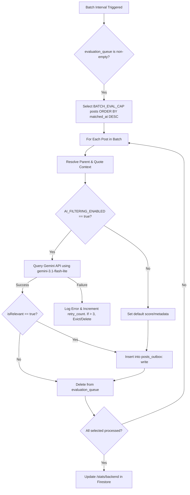

# Ingestion & Filtering Pipeline Specification

This document details the step-by-step logic for the real-time Jetstream consumer, the dynamic network graph sync, the local SQLite outbox queue, the fast rule-based pre-filter, the parent/quote context crawler, the liked/reposted content resolver, the Gemini LLM relevance evaluation workflow, error handling for processing failures, and the simple feedback archive mechanism.

---

## 1. Configuration Settings

The Home Server daemon loads configuration parameters from a local environment file (`.env`).

| ID | Configuration Key | Data Type | Default Value | Description |
|---|---|---|---|---|
| 1.1 | **`AI_FILTERING_ENABLED`** | boolean | `true` | When `false`, posts that match the pre-filter bypass Gemini evaluation and are written to the outbox immediately. |
| 1.2 | **`GEMINI_API_KEY`** | string | `""` | API key used for the Gemini relevance evaluation. Required if `AI_FILTERING_ENABLED` is `true`. |
| 1.3 | **`DATETIME_FORMAT`** | string | `"ISO-8601"` | Standard format for all database timestamps (UTC string, e.g., `YYYY-MM-DDTHH:mm:ss.sssZ`). |
| 1.4 | **`USER_DID`** | string | `""` | The ATProto Decentralized Identifier (DID) of the owner (used to monitor follow/like/repost events from the firehose). |
| 1.5 | **`GEMINI_MODEL`** | string | `"gemini-3.1-flash-lite"` | The Gemini model identifier used for relevance evaluation. |
| 1.6 | **`BATCH_INTERVAL_SECONDS`** | integer | `300` | Frequency of batch evaluation runs in seconds (default: 5 minutes / 300 seconds). |
| 1.7 | **`BATCH_EVAL_CAP`** | integer | `100` | Maximum number of posts evaluated in a single batch run. |
| 1.8 | **`SYSTEM_VERSION`** | string | `"v1.0.0"` | The version tag of the active deployment. |

---

## 2. Ingestion Flow (Jetstream Consumer)

The Home Server daemon maintains a persistent WebSocket connection to subscribe to posts, follows, reposts, and likes.

### 2.1 Connection & Handshake
* 2.1.1. **Target URL:** Connect to the Jetstream endpoint: `wss://jetstream2.us-east.bsky.network/subscribe`
* 2.1.2. **Query Parameters:** Filter firehose updates using the following parameters:
  - 2.1.2.1. `wantedCollections=app.bsky.feed.post`
  - 2.1.2.2. `wantedCollections=app.bsky.graph.follow`
  - 2.1.2.3. `wantedCollections=app.bsky.feed.repost`
  - 2.1.2.4. `wantedCollections=app.bsky.feed.like`
* 2.1.3. **Reconnection & Cursor Management:**
  - 2.1.3.1. Track the `seq` integer field from incoming messages.
  - 2.1.3.2. Persist the latest sequence number locally to a state file (`cursor.json`) every 5 seconds.
  - 2.1.3.3. Implement exponential backoff reconnection on disconnection: start at 1s, double up to a maximum of 60s, with a random jitter of ±100ms.
  - 2.1.3.4. When reconnecting, append the `cursor` query parameter with the last saved `seq` value:
    `wss://jetstream2.us-east.bsky.network/subscribe?wantedCollections=app.bsky.feed.post&wantedCollections=app.bsky.graph.follow&wantedCollections=app.bsky.feed.repost&wantedCollections=app.bsky.feed.like&cursor={seq}`
  - 2.1.3.5. **Expired Cursor Recovery:** If the WebSocket fails to connect with an `Unexpected server response: 400` error (indicating the cursor has expired), the client MUST reset the stored sequence number to `0`, delete the local `cursor.json` file, and reconnect without a cursor (falling back to the live tail).
  - 2.1.3.6. **WebSocket Liveness Heartbeat:** Since the firehose is highly active, if no message is received for 60 consecutive seconds while the socket state is `OPEN`, the client MUST forcefully terminate the connection (`ws.terminate()`) to trigger the close event handler and initiate reconnection.

### 2.2 Firestore Document ID Generation Rule
* 2.2.1. **Hashing Scheme:** Generate a predictable, unique document ID (`postId`) from the ATProto URI.
* 2.2.2. **Implementation:** Apply the `SHA-256` hashing algorithm to the post URI string (e.g., `at://did:plc:123/app.bsky.feed.post/456`), and use the resulting 64-character hex string as the Firestore Document ID.

### 2.3 Event Parsing & Operation Routing
For every message received, the daemon checks the collection type and routes the payload:
* 2.3.1. **`app.bsky.feed.post` Collections:**
  - 2.3.1.0. **Global Telemetry Update:** When any post event arrives (regardless of author or filters), immediately write an entry into the SQLite `metrics_log` table: `INSERT INTO metrics_log (event_type, created_at) VALUES ('firehose_received', '{CURRENT_TIMESTAMP}');` and update the in-memory timestamp variable `lastFirehosePostAt` to the current time.
  - 2.3.1.1. **Create Operations (`commit.operation == "create"`):** Check if the event author is `USER_DID`. If it matches, route to **Section 6.3: User Engagement Signals (False Negative Capture)**. Otherwise, route to **Section 3: Stage 1: Rule-Based & Network Pre-Filtering**. If the post passes Stage 1, extract parsed rich text facets and media embeds (Section 7), and insert the post into the SQLite `evaluation_queue` table (Section 4.1.4) for later batch evaluation.
  - 2.3.1.2. **Delete Operations (`commit.operation == "delete"`):** Construct the post URI (`at://{did}/{collection}/{rkey}`), calculate the Firestore document ID using the rule in section 2.2.2, write a delete action to the local outbox, and also delete the post from `evaluation_queue` if it is still pending evaluation.
* 2.3.2. **`app.bsky.graph.follow` Collections:**
  - 2.3.2.1. Route to **Section 4.3: Real-Time Firehose Syncing (Jetstream events)**.
* 2.3.3. **`app.bsky.feed.repost` & `app.bsky.feed.like` Collections:**
  - 2.3.3.1. **Create Operations (`commit.operation == "create"`):** If the actor `did` matches the user's DID (`USER_DID`) or matches an entry in `first_degree_follows`, route to **Section 6: Liked & Reposted Content Resolver**.
  - 2.3.3.2. **Delete Operations:** Ignore.
* 2.3.4. **Other Operations:** Discard immediately.

---

## 3. Stage 1: Rule-Based & Network Pre-Filtering

To minimize LLM token usage and latency, posts must pass a rule-based pre-filter.

Whenever a post successfully passes Stage 1 (either via network bypass, keyword match, or curated whitelist), the daemon must immediately write an entry into the SQLite `metrics_log` table:
`INSERT INTO metrics_log (event_type, created_at) VALUES ('passed_stage1', '{CURRENT_TIMESTAMP}');`
and update the in-memory timestamp variable `lastPassedStage1At` to the current time.

### 3.1 Language Gate (Preliminary Check)
* 3.1.1. **Rule:** Check the post's `langs` array (if present in the Jetstream record).
* 3.1.2. **Condition:** If the `langs` field is set (non-empty array) and does not contain the string `"en"` (English), the post must be discarded immediately. It does not proceed to network checks, keyword matching, or Gemini evaluation.

### 3.2 Network Graph Match (Bypass Keywords)
* 3.2.1. **Rule:** Check if the post `authorDid` matches an entry in your local SQLite table `first_degree_follows`.
* 3.2.2. **Outcome:** Posts matching this condition bypass keyword checks completely, parse rich text facets and media embeds (Section 7), and are inserted directly into the SQLite `evaluation_queue` table (Section 4.1.4) for batch evaluation (provided they pass the Language Gate).

### 3.3 Keyword & Regex Matching (For General Network Posts)
If the author is not in your network graph, the post text must match any of the following case-insensitive regex patterns:

#### 3.3.1 AT Protocol & Bluesky Keywords
* 3.3.1.1. `\batproto\b` (AT Protocol)
* 3.3.1.2. `\bbluesky\s+(api|dev|sdk)\b` (Bluesky development context)
* 3.3.1.3. `\blexicon(s)?\b` (ATProto Lexicon definitions)
* 3.3.1.4. `\bpds\b` (Personal Data Server)
* 3.3.1.5. `\bxrpc\b` (ATProto RPC protocol)
* 3.3.1.6. `\bappview\b` (AppView indexing)
* 3.3.1.7. `\bdid:(plc|web)\b` (Decentralized Identifiers)
* 3.3.1.8. `\bat://\S+\b` (AT URI scheme)
* 3.3.1.9. `\bfirehose\b` (ATProto event stream)
* 3.3.1.10. `\bjetstream\b` (Bluesky Jetstream firehose consumer)
* 3.3.1.11. `\brelay\b` (ATProto relay infrastructure)
* 3.3.1.12. `\bfeed\s*gen(erator)?\b` (ATProto feed generators)
* 3.3.1.13. `\blabeler\b` (ATProto labeling service)
* 3.3.1.14. `\bozone\b` (Bluesky moderation tooling)
* 3.3.1.15. `\bdata\s*repo(sitory)?\b` (ATProto data repositories)
* 3.3.1.16. `\b(app\.bsky|com\.atproto)\b` (ATProto NSID namespaces)
* 3.3.1.17. `\bbsky\.(social|app)\b` (Bluesky service domains)

#### 3.3.2 ActivityPub & Fediverse Keywords
* 3.3.2.1. `\bactivitypub\b` (ActivityPub protocol)
* 3.3.2.2. `\bfediverse\b` (Fediverse ecosystem)
* 3.3.2.3. `\bmastodon\b` (Mastodon platform)
* 3.3.2.4. `\bwebfinger\b` (WebFinger discovery protocol)
* 3.3.2.5. `\bactivity\s*streams\b` (ActivityStreams data format)
* 3.3.2.6. `\bnodeinfo\b` (NodeInfo server metadata)
* 3.3.2.7. `\bmisskey\b` (Misskey platform)
* 3.3.2.8. `\bpleroma\b` (Pleroma platform)
* 3.3.2.9. `\blemmy\b` (Lemmy federated link aggregation)
* 3.3.2.10. `\bpixelfed\b` (Pixelfed federated image sharing)
* 3.3.2.11. `\bgotosocial\b` (GoToSocial AP server)
* 3.3.2.12. `\bakkoma\b` (Akkoma fediverse server)
* 3.3.2.13. `\bsharkey\b` (Sharkey Misskey fork)
* 3.3.2.14. `\bfederated\s+timeline\b` (Fediverse timeline concepts)

#### 3.3.3 Adjacent Protocols & Standards
* 3.3.3.1. `\bnostr\b` (Nostr protocol)
* 3.3.3.2. `\bfarcaster\b` (Farcaster protocol)
* 3.3.3.3. `\bindieweb\b` (IndieWeb movement)
* 3.3.3.4. `\bwebmention\b` (Webmention protocol)
* 3.3.3.5. `\bsolid\s+(protocol|pod|project)\b` (Solid decentralized data platform)
* 3.3.3.6. `\blinked\s*data\b` (Linked Data / JSON-LD context)

#### 3.3.4 General Open Social Web Keywords
* 3.3.4.1. `\bfederat(e|ed|ion|ing)\b` (Federation context)
* 3.3.4.2. `\bself-host(ing|ed)?\b` (Self-hosting)
* 3.3.4.3. `\bopen\s+social\b` (Open social web)
* 3.3.4.4. `\bdecentraliz(e|ed|ation|ing)\b` (Decentralized social)
* 3.3.4.5. `\bsocial\s+(web|protocol|graph|interop)\b` (Social web development)
* 3.3.4.6. `\bprotocol\s+interop(erability)?\b` (Protocol interoperability)
* 3.3.4.7. `\bsocial\s+network\s+(protocol|standard)\b` (Social network protocols)

### 3.4 Curated Whitelist Matching
* 3.4.1. **Rule:** Check if the post `authorDid` matches an entry in the locally stored whitelist file (`curated_devs.json`), or is a reply to/repost of someone on that list.

---

## 4. SQLite Database Specifications (`network_graph.db`)

The daemon manages local state using a single-file SQLite database.

### 4.1 Schema
The SQLite database must contain the following tables:

* 4.1.1. **`first_degree_follows` Table:**
```sql
CREATE TABLE first_degree_follows (
    rkey TEXT PRIMARY KEY,
    followed_did TEXT UNIQUE
);
```
* 4.1.2. **`posts_outbox` Table:**
```sql
CREATE TABLE posts_outbox (
    post_id TEXT PRIMARY KEY,       -- SHA-256 hash of post URI
    uri TEXT NOT NULL,
    action TEXT NOT NULL,          -- 'write' or 'delete'
    payload TEXT,                  -- JSON string of document fields (NULL for 'delete')
    status TEXT DEFAULT 'pending', -- 'pending', 'failed'
    retry_count INTEGER DEFAULT 0,
    created_at TEXT NOT NULL       -- ISO-8601 UTC string
);
```
* 4.1.3. **`processing_failures` Table:**
```sql
CREATE TABLE processing_failures (
    id INTEGER PRIMARY KEY AUTOINCREMENT,
    event_type TEXT NOT NULL,      -- 'post_ingest', 'follow_ingest', 'like_ingest', 'repost_ingest', 'context_fetch', 'gemini_call', 'firestore_sync'
    raw_payload TEXT,              -- Stringified Jetstream or API JSON payload
    error_message TEXT NOT NULL,   -- Description of exception
    created_at TEXT NOT NULL       -- ISO-8601 UTC string
);
```
* 4.1.4. **`evaluation_queue` Table:**
```sql
CREATE TABLE evaluation_queue (
    uri TEXT PRIMARY KEY,
    cid TEXT NOT NULL,
    author_did TEXT NOT NULL,
    author_handle TEXT NOT NULL,
    text TEXT NOT NULL,
    langs TEXT,                    -- JSON stringified array of languages
    facets TEXT,                   -- JSON stringified array of facets (from section 7)
    media_embed TEXT,              -- JSON stringified mediaEmbed object (from section 7)
    match_rules TEXT NOT NULL,     -- JSON stringified array of matched rules
    retry_count INTEGER DEFAULT 0,
    created_at TEXT NOT NULL,      -- ISO-8601 UTC string (post creation)
    matched_at TEXT NOT NULL       -- ISO-8601 UTC string (ingestion time)
);
```
* 4.1.5. **`metrics_log` Table & Index:**
```sql
CREATE TABLE metrics_log (
    event_type TEXT NOT NULL,      -- 'firehose_received', 'passed_stage1', 'passed_stage2'
    created_at TEXT NOT NULL       -- ISO-8601 UTC string (event timestamp)
);

CREATE INDEX idx_metrics_created_at ON metrics_log(created_at);
```

### 4.2 Startup Sync Logic
* 4.2.1. **Sync check:** On initial startup (or if the database is unpopulated):
* 4.2.2. **Fetch and Populate:** Call the ATProto XRPC endpoint `app.bsky.graph.getFollows` for your `USER_DID`. Store all returned DIDs in `first_degree_follows`.

### 4.3 Real-Time Firehose Syncing (Jetstream events)
As follow events arrive, update the local SQLite database in real-time:
* 4.3.1. **Create Operations (`commit.operation == "create"`):**
  - 4.3.1.1. Verify that `did == USER_DID` (the event actor is you).
  - 4.3.1.2. Write `rkey` and `subject` (the followed user's DID) into `first_degree_follows`.
* 4.3.2. **Delete Operations (`commit.operation == "delete"`):**
  - 4.3.2.1. Verify that `did == USER_DID` (the event actor is you).
  - 4.3.2.2. Find the `followed_did` in `first_degree_follows` matching the deleted `rkey`.
  - 4.3.2.3. Delete that row from `first_degree_follows`.

---

## 5. Thread & Quote Context Retrieval

If an ingested post passes Stage 1, the daemon must check for external post references and resolve their contents prior to LLM evaluation.

### 5.1 Parent Post Resolution
* 5.1.1. **Trigger:** The post record contains a `reply` object containing `reply.parent.uri`.
* 5.1.2. **Action:** Call the public AppView endpoint to fetch the parent post metadata:
  ```http
  GET https://api.bsky.app/xrpc/app.bsky.feed.getPosts?uris={reply.parent.uri}
  ```
* 5.1.3. **Parsing:** Generate the `parentContext` object: `{ uri, authorHandle, text }`. If the fetch fails, set the field to `null`.

### 5.2 Quoted Post Resolution
* 5.2.1. **Trigger:** The post record contains an `embed` object where `embed.$type == "app.bsky.embed.record"` containing `embed.record.uri`.
* 5.2.2. **Action:** Call the public AppView endpoint to fetch the quote post metadata:
  ```http
  GET https://api.bsky.app/xrpc/app.bsky.feed.getPosts?uris={embed.record.uri}
  ```
* 5.2.3. **Parsing:** Generate the `quotedContext` object: `{ uri, authorHandle, text }`. If the fetch fails, set the field to `null`.

---

## 6. Liked & Reposted Content Resolver

When someone you follow likes or reposts (boosts) a post, that target post is resolved and routed directly to evaluation.

### 6.1 Event Validation
* 6.1.1. **Trigger:** A `create` event is received in `app.bsky.feed.repost` or `app.bsky.feed.like`.
* 6.1.2. **Validation:** Check if the event actor `did` is present in your local `first_degree_follows` table (or matches `USER_DID`).
* 6.1.3. **Extraction:** If validation succeeds, extract the target post's URI: `subjectUri = commit.record.subject.uri`.

### 6.2 Target Post Content Fetching
* 6.2.1. **Action:** Query the public AppView endpoint:
  ```http
  GET https://api.bsky.app/xrpc/app.bsky.feed.getPosts?uris={subjectUri}
  ```
* 6.2.2. **Parsing:** Extract the post contents (text, author DID, author handle, created timestamp, facets, and media embeds).
* 6.2.3. **Match Rule Logging:** Add the string `"repost:{actorHandle}"` or `"like:{actorHandle}"` to the post's `matchRules` metadata array.
* 6.2.4. **Routing:** Insert the resolved post payload (including text, author DID, author handle, created timestamp, facets, media embeds, and `matchRules` array) directly into the SQLite `evaluation_queue` table (Section 4.1.4) for batch evaluation.

### 6.3 User Engagement Signals (False Negative Capture)
To prevent posts that the user has already engaged with (made, liked, reposted, or replied to) from showing up as unrated cards in their feed, while still tracking them to analyze classifier omissions (false negatives), the daemon implements the following capture rules:
* 6.3.1. **Engagement Detection:** The daemon monitors the Jetstream consumer for operations where `did == USER_DID` (indicating actions by the owner):
  - 6.3.1.1. **User Posts and Replies (`app.bsky.feed.post` create):** Extract the post's URI. If it contains a `reply` parent, extract the parent URI (and quote URI if present) as well.
  - 6.3.1.2. **User Likes and Reposts (`app.bsky.feed.like` and `app.bsky.feed.repost` create):** Extract the target post's URI (`subject.uri`).
* 6.3.2. **Resolution & Direct Ingest (No Re-Showing):** For each target URI resolved under Section 6.3.1:
  - 6.3.2.1. Check if the post already exists in Firestore (via Document ID hash). If it exists and `feedback` is not null, do nothing. If `feedback` is null, proceed to update it.
  - 6.3.2.2. If the post is not in Firestore, fetch its full contents from the AppView `getPosts` endpoint.
  - 6.3.2.3. Mark the post's metadata: set `matchRules = ["user_engagement_signal"]`, and include `version = SYSTEM_VERSION` representing the active version.
  - 6.3.2.4. Write `feedback = "interacted"` and `feedbackAt = current_timestamp` in the Firestore document payload.
  - 6.3.2.5. Generate the local outbox transaction and insert the record into SQLite `posts_outbox` table (action = 'write', status = 'pending') directly, bypassing the `evaluation_queue` and the Gemini API classification. Because `feedback` is set to `"interacted"`, it automatically hides the post from the Feed view (`feedback == null` query constraint) while persisting it for analysis.

---

## 7. Rich Text Facets & Media Embed Processing

To ensure links and media display correctly without downloading content to the home server, the daemon parses facets and constructs public CDN hotlink URLs at ingestion time.

### 7.1 Facets Parsing (Links & Mentions)
If the Jetstream record contains a `facets` array, parse each entry:
* 7.1.1. Extract the byte indexes: `start` and `end` from `index.byteStart` and `index.byteEnd`.
* 7.1.2. Map the feature type:
  - 7.1.2.1. **Link (`$type == "app.bsky.richtext.facet#link"`):** Save as `{ "start": start, "end": end, "type": "link", "uri": feature.uri }`.
  - 7.1.2.2. **Tag (`$type == "app.bsky.richtext.facet#tag"`):** Save as `{ "start": start, "end": end, "type": "tag", "tag": feature.tag }`.
  - 7.1.2.3. **Mention (`$type == "app.bsky.richtext.facet#mention"`):** Save as `{ "start": start, "end": end, "type": "mention", "did": feature.did }`.

### 7.2 Media Embed hotlinking
If the Jetstream record contains an `embed` object, inspect the type and map it to `mediaEmbed` fields using public CDN structures:

#### 7.2.1 Images (`embed.$type == "app.bsky.embed.images"`)
* 7.2.1.1. Iterate the `images` array.
* 7.2.1.2. For each image blob containing a reference link `image.ref.$link`:
  - 7.2.1.2.1. **Construct `thumbUrl`:** `https://cdn.bsky.app/img/feed_thumbnail/plain/{authorDid}/{image.ref.$link}@jpeg`
  - 7.2.1.2.2. **Construct `fullsizeUrl`:** `https://cdn.bsky.app/img/feed_fullsize/plain/{authorDid}/{image.ref.$link}@jpeg`
  - 7.2.1.2.3. Save to Firestore under `mediaEmbed.images` array.

#### 7.2.2 External Link Cards (`embed.$type == "app.bsky.embed.external"`)
* 7.2.2.1. Extract `external` metadata: `uri`, `title`, `description`.
* 7.2.2.2. If a thumbnail blob reference exists under `external.thumb.ref.$link`:
  - 7.2.2.2.1. **Construct `thumbUrl`:** `https://cdn.bsky.app/img/feed_thumbnail/plain/{authorDid}/{external.thumb.ref.$link}@jpeg`
  - 7.2.2.2.2. Save to Firestore under `mediaEmbed.externalLink`.

#### 7.2.3 Videos (`embed.$type == "app.bsky.embed.video"`)
* 7.2.3.1. Extract the video blob CID: `embed.video.ref.$link`.
* 7.2.3.2. **Construct `playlistUrl` (HLS master playlist):** `https://video.cdn.bsky.app/hls/{authorDid}/{video_blob_cid}/playlist.m3u8`
* 7.2.3.3. **Construct `thumbnailUrl` (HLS video thumbnail):** `https://video.cdn.bsky.app/hls/{authorDid}/{video_blob_cid}/thumbnail.jpg`
* 7.2.3.4. Save to Firestore under `mediaEmbed.video`.

---

## 8. Stage 2: Relevance Evaluation & Batching Flow

If a post passes Stage 1 (or is routed from the Like/Repost resolver), it is queued for batch processing.



### 8.1 AI-Bypass Mode (`AI_FILTERING_ENABLED = false`)
* 8.1.1. In bypass mode, the batch system is bypassed entirely.
* 8.1.2. The daemon processes the post at ingestion time, generating the JSON payload containing the parsed `facets` and `mediaEmbed` objects.
* 8.1.3. Insert a record directly into the SQLite table `posts_outbox` with `action = 'write'`, `status = 'pending'`, and standard values (`relevanceScore = 100`, `relevanceExplanation = "Bypassed filtering by configuration"`).

### 8.2 AI-Evaluation Mode & Batch Processing (`AI_FILTERING_ENABLED = true`)
* 8.2.1. **Model:** Use `gemini-3.1-flash-lite` (or custom model specified in `GEMINI_MODEL`).
* 8.2.2. **Parameters:** Set `temperature: 0.1` and `responseMimeType: "application/json"`.
* 8.2.3. **JSON Output Schema:** Enforce response structure matching a JSON array of objects:
```json
[
  {
    "uri": "string",
    "isRelevant": boolean,
    "score": integer,
    "reasoning": string
  }
]
```
* 8.2.4. **Batch processing loop:** An asynchronous background worker runs continuously every `BATCH_INTERVAL_SECONDS` (default: 300 seconds / 5 minutes).
  - 8.2.4.1. **Fetch Queue:** Query the SQLite `evaluation_queue` table for posts to process:
    ```sql
    SELECT * FROM evaluation_queue ORDER BY matched_at DESC LIMIT {BATCH_EVAL_CAP};
    ```
    Ordering by `matched_at DESC` ensures that more recent posts are processed first (prioritized) if a large backlog builds up.
  - 8.2.4.2. **Resolve Contexts:** For each selected post, check for external post references and resolve their content:
    - 8.2.4.2.1. Resolve the parent post thread context (Section 5.1).
    - 8.2.4.2.2. Resolve the quoted post context (Section 5.2).
  - 8.2.4.3. **Single API Evaluation Call (Hard Limit Constraint):** To strictly enforce that Gemini is called at most once per 5 minutes, the worker must group all selected posts (up to `BATCH_EVAL_CAP`) and evaluate them in a **single Gemini API call**. The worker constructs a single user prompt containing the array of posts (formatted per the User Prompt Template in Section 8.2.6), sends it to the Gemini API, and expects a single JSON array of classification results matching the JSON Output Schema (Section 8.2.3).
  - 8.2.4.4. **Outcome Routing:** Upon receiving the JSON array response:
    - 8.2.4.4.1. Iterate through the items in the returned JSON array. Match each classification result to its original queued post using the `uri` field.
    - 8.2.4.4.2. For each post where `isRelevant == true`, generate the Firestore payload structure (incorporating the parsed media embeds, facets, contexts, score, explanation, and matched rules, along with `version = SYSTEM_VERSION`) and insert a row into the SQLite `posts_outbox` table with `action = 'write'`, `status = 'pending'`. Immediately write a metrics entry: `INSERT INTO metrics_log (event_type, created_at) VALUES ('passed_stage2', '{CURRENT_TIMESTAMP}');` and update the local variable `lastPassedStage2At` to the current time.
    - 8.2.4.4.3. Delete all successfully evaluated posts from `evaluation_queue` (by URI).
  - 8.2.4.5. **Batch Error & Retry Handling:** If the single Gemini API call fails (due to connection timeout, rate limits, API outage, or JSON array schema mismatch):
    - 8.2.4.5.1. Increment the `retry_count` for all posts included in that batch within the `evaluation_queue` table.
    - 8.2.4.5.2. For any post in the batch where `retry_count > 3`, log a failure entry to `processing_failures` with `event_type = 'gemini_call'` and delete it from `evaluation_queue`.
    - 8.2.4.5.3. For posts where `retry_count <= 3`, keep them in `evaluation_queue` to be processed again during the next batch run.

* 8.2.5. **Statistics Publishing:** Immediately after completing each batch run (and refreshed at least every 5 minutes), and also on a recurring heartbeat timer every 60 seconds, the daemon must update a single statistics document in Cloud Firestore at the path `/stats/backend`. During each batch execution, the daemon must aggregate metrics from `metrics_log` and prune expired records:
  - 8.2.5.0.1. **Pruning Query:** Run `DELETE FROM metrics_log WHERE created_at < datetime('now', '-24 hours');` to prevent infinite table growth.
  - 8.2.5.0.2. **Aggregation Queries:** Calculate counts for the last 1 hour (`datetime('now', '-1 hour')`) and 24 hours (`datetime('now', '-24 hours')`) for each of the three event types (`firehose_received`, `passed_stage1`, `passed_stage2`).
  - 8.2.5.1. `lastActive`: string (ISO-8601 UTC timestamp of the latest heartbeat or update).
  - 8.2.5.2. `lastBatchTime`: string (ISO-8601 UTC timestamp of the last completed batch processing run).
  - 8.2.5.3. `queueSize`: integer (count of rows currently remaining in SQLite `evaluation_queue` table).
  - 8.2.5.4. `geminiFailureCount24h`: integer (count of entries in `processing_failures` with `event_type == 'gemini_call'` created in the last 24 hours).
  - 8.2.5.5. `lastBatchProcessedCount`: integer (total posts selected in the most recent batch).
  - 8.2.5.6. `lastBatchSuccessCount`: integer (number of posts successfully evaluated in the most recent batch).
  - 8.2.5.7. `lastBatchRelevantCount`: integer (number of posts from the batch that were found relevant and written to the outbox).
  - 8.2.5.8. `lastError`: string or null (the error message of the most recent failure in the `processing_failures` table, or `null` if no failures).
  - 8.2.5.9. `backendStatus`: string (`"online"`).
  - 8.2.5.10. **Throughput Counters:**
    - 8.2.5.10.1. `firehoseCount1h` & `firehoseCount24h`: integer (count of posts ingested from the firehose).
    - 8.2.5.10.2. `passedStage1Count1h` & `passedStage1Count24h`: integer (count of posts passing Stage 1 pre-filtering).
    - 8.2.5.10.3. `passedStage2Count1h` & `passedStage2Count24h`: integer (count of posts passing Gemini relevance).
  - 8.2.5.11. **Activity Timestamps:**
    - 8.2.5.11.1. `lastFirehosePostAt`: string or null (ISO-8601 UTC timestamp of when the last post was received from the firehose).
    - 8.2.5.11.2. `lastPassedStage1At`: string or null (ISO-8601 UTC timestamp of when the last post passed Stage 1).
    - 8.2.5.11.3. `lastPassedStage2At`: string or null (ISO-8601 UTC timestamp of when the last post passed Stage 2).
  - 8.2.5.12. `version`: string (the current `SYSTEM_VERSION` of the backend daemon).

* 8.2.6. **Startup Deployment Shift Tracker:** On backend startup, the daemon must query the Firestore `/deployments` collection for the latest deployment document (sorted by `deployedAt` DESC):
  - 8.2.6.1. If the latest deployment document has a different `version` than the current `SYSTEM_VERSION` OR if configuration settings (`GEMINI_MODEL`, `BATCH_INTERVAL_SECONDS`, `BATCH_EVAL_CAP`) differ from the values stored in the document:
    - 8.2.6.1.1. Write a new document to `/deployments` with a generated ID (e.g. `{version}_{timestamp}`):
      ```json
      {
        "version": "v1.0.0", // matches SYSTEM_VERSION
        "deployedAt": "2026-07-05T14:00:00.000Z",
        "environment": "backend",
        "model": "gemini-3.1-flash-lite",
        "batchIntervalSeconds": 300,
        "batchEvalCap": 100,
        "aiFilteringEnabled": true
      }
      ```

* 8.3. **System Prompt:** The following exact text must be sent as the system instruction to the Gemini model. It must not be modified by the implementing agent.

```
You are a relevance filter for an open social web developer feed. Your job is to evaluate a batch of social media posts and determine whether they are worth surfacing to a software engineer who is active in the AT Protocol (atproto) and ActivityPub developer ecosystems and works at Google.

The engineer wants to:
- Stay current on technical developments across atproto, ActivityPub, the fediverse, and the broader open/decentralized social web.
- Find posts worth reading for learning or situational awareness.
- Find posts with a natural opening to reply — such as technical questions, proposals, pain points, or discussions — where a knowledgeable response would be valuable and help build their reputation in the community.

Evaluate each post in the input batch based on these criteria:

HIGH RELEVANCE (score 80-100):
- Someone asking a technical question about atproto, ActivityPub, PDS hosting, Lexicon design, feed generators, federation, or related protocol internals.
- Proposals, RFCs, or design discussions for new protocol features or changes.
- Posts discussing interoperability between atproto, ActivityPub, Nostr, or other decentralized protocols.
- Developer experience pain points, bug reports, or frustrations with protocol tooling.
- Posts about Google's involvement with the open social web, social interoperability, or related standards work.
- Any post where a thoughtful technical reply would be especially impactful.

MEDIUM RELEVANCE (score 50-79):
- Announcements of new tools, libraries, bots, or projects built on atproto or ActivityPub.
- Technical blog posts, tutorials, or documentation being shared.
- General developer discussion about federation architecture, self-hosting, or decentralized identity.
- Posts from developers sharing what they are building, with enough technical detail to be interesting.

LOW RELEVANCE (score 20-49):
- Tangential ecosystem commentary with little technical substance.
- Posts that mention relevant keywords but are primarily about non-technical topics (e.g., moderation policy debates, social commentary).
- Simple project announcements with no technical depth.

IRRELEVANT (score 0-19, mark isRelevant = false):
- Casual "I love Bluesky" or "I joined Mastodon" sentiment with no technical content.
- Memes, jokes, or shitposts that happen to mention a relevant keyword.
- Pure news resharing or link drops with no added commentary.
- Marketing, self-promotion spam, or engagement bait.
- Culture war or political content that tangentially references decentralized social media.

IMPORTANT RULES:
- Evaluate each post on its own content merit. Do not factor in who the author is.
- If parent or quoted post context is provided, use it to better understand the conversation. A reply that seems vague on its own may be highly relevant in the context of a technical thread.
- A post routed via a like or repost from someone the engineer follows has already passed a social signal check; still evaluate it on content merit but recognize it reached the pipeline through trusted network activity.
- When scoring, give higher weight to posts where there is a clear opportunity to respond and add value versus posts that are just interesting to read.
- Be concise in your reasoning (1-2 sentences).
- You must return a JSON array containing an evaluation object for every post in the input batch, maintaining the correct URI for each.
```

* 8.2.6. **User Prompt Template:** For each batch evaluated, construct the user message as a JSON array of post evaluation requests. For each post, include its URI, text, optional parent/quoted contexts, and its match rules path:

```json
[
  {
    "uri": "{postUri}",
    "text": "{postText}",
    "parentContext": {parentContext || null}, // Included as { uri, authorHandle, text } or null
    "quotedContext": {quotedContext || null}, // Included as { uri, authorHandle, text } or null
    "capturePath": {matchRules}               // Array of match rule strings
  },
  ...
]
```

---

## 9. Error Handling & Exception Logging

To isolate errors and debug processing failures without halting ingestion, all core steps inside the daemon must execute within `try-catch` structures.

### 9.1 Failures Capture Logic
Catch exceptions in the following segments:
* 9.1.1. **WebSocket Parse Failure:** Received data is malformed or cannot be unmarshaled.
* 9.1.2. **HTTP Fetch Outage:** Outbound calls to AppView (`getPosts` or follow resolutions) fail or return non-200 codes.
* 9.1.3. **AI Classification Fail:** Gemini API yields timeout, rate limits, or parsing failures.
* 9.1.4. **Local DB Write Error:** SQLite locks or transaction aborts.
* 9.1.5. **Firestore Sync Timeout:** Cloud sync worker fails to write payload.

### 9.2 SQL Insertion
* 9.2.1. Log the captured error directly to the local `processing_failures` table:
```sql
INSERT INTO processing_failures (event_type, raw_payload, error_message, created_at)
VALUES (
    '{EVENT_TYPE}',          -- e.g., 'gemini_call'
    '{RAW_JSON_PAYLOAD}',    -- Stringified event payload
    '{ERROR_MESSAGE_STRING}',-- Exact exception text
    '{CURRENT_UTC_TIMESTAMP}'
);
```

---

## 10. Firestore Outbox Sync Worker

An asynchronous background task within the daemon runs continuously to push local outbox records to Firebase Firestore.

### 10.1 Sync Execution Loop
* 10.1.1. Query SQLite `posts_outbox` for items where `status = 'pending'` or `status = 'failed'` ordered by `created_at` ASC.
* 10.1.2. Process each returned item:
  - 10.1.2.1. **Case A: `action == 'write'`**
    - 10.1.2.1.1. Parse the `payload` JSON string.
    - 10.1.2.1.2. Call the Firestore SDK to write/upsert the document: `db.collection('posts').doc(post_id).set(payload_object)`.
  - 10.1.2.2. **Case B: `action == 'delete'`**
    - 10.1.2.2.1. Call the Firestore SDK to soft-delete the document: `db.collection('posts').doc(post_id).update({ isDeleted: true })`.
  - 10.1.2.3. **On Success:** Delete the row from the local `posts_outbox` table.
  - 10.1.2.4. **On Failure:**
    - 10.1.2.4.1. Increment the `retry_count` in the SQLite table.
    - 10.1.2.4.2. Set `status = 'failed'`.
    - 10.1.2.4.3. Stop execution of the loop, sleep for a backoff duration, and then retry.

### 10.2 Backoff Constraints
* 10.2.1. **Delay Algorithm:** Use exponential backoff with jitter:
  `delay = min(5000 * (1.5 ^ retry_count), 300000) + random_jitter_ms` (Starts at 5s, doubles up to a maximum delay of 5 minutes).

---

## 11. Stage 3: Simple Feedback Accumulation

* 11.1. **Dashboard UI Action:** User feedback Thumbs Up/Down updates the Firestore record setting `feedback` to `"relevant"`, `"irrelevant"`, etc.
* 11.2. **Local Synced Log:** Every 24 hours, the home server daemon queries Firestore for all rated posts and appends them to `./data/feedback_archive.jsonl`.

---

## 12. Assumptions Log

| ID | Description | Status | Resolution / Date |
|---|---|---|---|
| A005 | Datetime fields must use ISO-8601 UTC strings. | `[CONFIRMED]` | Confirmed by User on 2026-07-01. |
| A006 | The Gemini API key will be loaded via a local env file on the Home Server. | `[CONFIRMED]` | Confirmed by User on 2026-07-01. |
| A009 | The default cap on the number of posts processed in a single batch is 100. | `[CONFIRMED]` | Confirmed by User on 2026-07-05. |
| A010 | Backlogged posts exceeding the batch cap are kept in the queue indefinitely to carry over. | `[CONFIRMED]` | Confirmed by User on 2026-07-05. |
